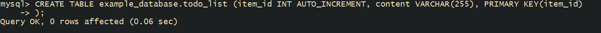

# LEMP STACK IMPLEMENTATION IN AWS

## Introduction:

The LEMP stack is a popular open-source web development platform that consists of four main components: Linux, Nginx, MySQL, and PHP (or sometimes Perl or Python). This documentation outlines the setup, configuration, and usage of the LEMP stack.

Creating EC2 Instance and establishing SSH Connection.

Created an AWS Account after which a new EC2 instance of the t2.micro family within the free tier was created with an Ubuntu Server Installed. A new key pair was created and downloaded to the local machine.


## STEP 1 - Installing the Nginx Web Server 

 Update the server's package.
```
sudo apt update
```


Install the nginx package
```
sudo apt install nginx
```


Run the commaand below to confirm the status of nginx.
```
sudo systemctl status nginx
```


Access nginx locally on the Ubuntu shell
```
curl http://localhost:80

```


Access the Nginx web server using the public IP on port 80


## STEP 2- Installing MySQL

Again, use 'apt' to acquire and install this software:

```
sudo apt install mysql-server
```


When the installation is finished, log in to the MySQL console by typing:

```
sudo mysql
```

Set a password for root user using mysql_native_password as default authentication method.

Here, the user's password was defined as "PassWord.1235"

```
ALTER USER 'root'@'localhost' IDENTIFIED WITH mysql_native_password BY 'PassWord.1235';
```

And type 'exit'.


After changing root user password, log in to MySQL console.

A command prompt for password was noticed after running the command below.

```
sudo mysql -p
```


Exit MySQL shell

```
exit
```


## STEP 3 - Install PHP Package

Install php-fpm (PHP fastCGI process manager) and tell nginx to pass PHP requests to this software for processing. Also, install php-mysql, a php module that allows PHP to communicate with MySQL-based databases. Core PHP packages will automatically be installed as dependencies.

The following were installed:

php-fpm (PHP fastCGI process manager)
php-mysql

$ sudo apt install php-fpm php-mysql -y


## Step 4 - Configuring Nginx to Use PHP Processor

When using the Nginx web server, we can create server blocks (similar to virtual hosts in Apache) to encapsulate configuration details and host more than one domain on a single server. In this guide, we will use `projectLEMP` as an example domain name.

On Ubuntu 20.04, Nginx has one server block enabled by default and is configured to serve documents out of a directory at `/var/www/html`. While this works well for a single site, it can become difficult to manage if you are hosting multiple sites. Instead of modifying `/var/www/html`, we’ll create a directory structure within `/var/www` for the `your_domain` website, leaving `/var/www/html` in place as the default directory to be served if a client request does not match any other sites.

Create the root web directory for `your_domain` as follows:

    sudo mkdir /var/www/projectLEMP

Next, assign ownership of the directory with the `$USER` environment variable, which will reference your current system user:

    sudo chown -R $USER:$USER /var/www/projectLEMP

Then, open a new configuration file in Nginx’s `sites-available` directory using your preferred command-line editor. Here, we’ll use `nano`:

    sudo nano /etc/nginx/sites-available/projectLEMP

This will create a new blank file. Paste in the following bare-bones configuration:

    # /etc/nginx/sites-available/projectLEMP

    server {
        listen 80;
        server_name projectLEMP www.projectLEMP;
        root /var/www/projectLEMP;

        index index.html index.htm index.php;

        location / {
            try_files $uri $uri/ =404;
        }

        location ~ \.php$ {
            include snippets/fastcgi-php.conf;
            fastcgi_pass unix:/var/run/php/php8.3-fpm.sock;
        }

        location ~ /\.ht {
            deny all;
        }
    }

Here’s what each of these directives and location blocks do:

- **listen** — Defines what port Nginx will listen on. In this case, it will listen on port 80, the default port for HTTP.
- **root** — Defines the document root where the files served by this website are stored.
- **index** — Defines in which order Nginx will prioritize index files for this website. It is a common practice to list `index.html` files with a higher precedence than `index.php` files to allow for quickly setting up a maintenance landing page in PHP applications. You can adjust these settings to better suit your application needs.
- **server_name** — Defines which domain names and/or IP addresses this server block should respond for. Point this directive to your server’s domain name or public IP address.
- **location /** — The first location block includes a `try_files` directive, which checks for the existence of files or directories matching a URI request. If Nginx cannot find the appropriate resource, it will return a 404 error.
- **location ~ \.php$** — This location block handles the actual PHP processing by pointing Nginx to the `fastcgi-php.conf` configuration file and the `php8.1-fpm.sock` file, which declares what socket is associated with php-fpm.
- **location ~ /\.ht** — The last location block deals with `.htaccess` files, which Nginx does not process. By adding the `deny all` directive, if any `.htaccess` files happen to find their way into the document root, they will not be served to visitors.

When you’re done editing, save and close the file. If you’re using `nano`, you can do so by typing `CTRL+X` and then `y` and `ENTER` to confirm.

Activate your configuration by linking to the config file from Nginx’s `sites-enabled` directory:

    sudo ln -s /etc/nginx/sites-available/projectLEMP /etc/nginx/sites-enabled/

This will tell Nginx to use the configuration next time it is reloaded. You can test your configuration for syntax errors by typing:

    sudo nginx -t

You shall see the following message:

    nginx: the configuration file /etc/nginx/nginx.conf syntax is ok
    nginx: configuration file /etc/nginx/nginx.conf test is successful

If any errors are reported, go back to your configuration file to review its contents before continuing.

We also need to disable the default Nginx host that is currently configured to listen on port 80. For this, run:

    sudo unlink /etc/nginx/sites-enabled/default

When you are ready, reload Nginx to apply the changes:

    sudo systemctl reload nginx


Your new website is now active, but the web root `/var/www/projectLEMP` is still empty. Create an `index.html` file in that location so that we can test that your new server block works as expected:

    sudo echo 'Hello LEMP from hostname' $(curl -s http://169.254.169.254/latest/meta-data/public-hostname) 'with public IP' $(curl -s http://169.254.169.254/latest/meta-data/public-ipv4) > /var/www/projectLEMP/index.html


Now go to your browser and try to open your website URL using the IP address:

    http://<Public-IP-Address>:80


If you see the text from the `echo` command you wrote to the `index.html` file, then it means your Nginx site is working as expected. In the output, you will see your server's public hostname (DNS name) and public IP address. You can also access your website in your browser by public DNS name, not only by IP - try it out, the result must be the same (port is optional):

    http://<Public-DNS-Name>:80

You can leave this file in place as a temporary landing page for your application until you set up an `index.php` file to replace it. Once you do that, remember to remove or rename the `index.html` file from your document root, as it would take precedence over an `index.php` file by default.


## STEP 5 - Test PHP with Nginx

After successfully setting up the LEMP stack, it is important to test to validate that Nginx handles .php correctly.

Create a new file called info.php within the document root in the command: nano /var/www/projectLEMP/info.php

Paste in the following in the file: <?php
phpinfo();


Access the page on the browser and attach /info.php

http://public-ip/info.php


After checking the relevant information about the server through this page, It’s best to remove the file created as it contains sensitive information about the PHP environment and the ubuntu server. It can always be recreated if the information is needed later.

```
$ sudo rm /var/www/projectLEMP/info.php
```

## Step 6 - Retrieving Data from MySQL Database with PHP

In this step, you will create a test database (DB) with a simple "To do list" and configure access to it, so the Nginx website will be able to query data from the DB and display it.

At the time of this writing, the native MySQL PHP library `mysqlnd` doesn’t support `caching_sha2_authentication`, the default authentication method for MySQL 8. We’ll need to create a new user with the `mysql_native_password` authentication method to connect to the MySQL database from PHP.

We will create a database named `example_database` and a user named `example_user`, but you can replace these names with different values.

### Step 6.1: Create the Database and User

First, connect to the MySQL console using the root account:

    sudo mysql

To create a new database, run the following command from your MySQL console:

    CREATE DATABASE `example_database`;


Now you can create a new user and grant them full privileges on the database you have just created.

The following command creates a new user named `example_user`, using `mysql_native_password` as the default authentication method. We’re defining this user’s password as `PassWord.1`, but you should replace this value with a secure password of your own choosing.

    CREATE USER 'example_user'@'%' IDENTIFIED WITH mysql_native_password BY 'PassWord.1';

Now we need to give this user permission over the `example_database` database:

    GRANT ALL ON example_database.* TO 'example_user'@'%';

This will give the `example_user` user full privileges over the `example_database` database while preventing this user from creating or modifying other databases on your server.


Now exit the MySQL shell with:

    mysql> exit

### Step 6.2: Verify the New User

You can test if the new user has the proper permissions by logging in to the MySQL console again, this time using the custom user credentials:

    mysql -u example_user -p

Notice the `-p` flag in this command, which will prompt you for the password used when creating the `example_user` user. After logging in to the MySQL console, confirm that you have access to the `example_database` database:

    SHOW DATABASES;

This will give you the following output:


### Step 6.3: Create a Test Table

Next, we’ll create a test table named `todo_list`. From the MySQL console, run the following statement:

    mysql> CREATE TABLE example_database.todo_list (
        item_id INT AUTO_INCREMENT,
        content VARCHAR(255),
        PRIMARY KEY(item_id)
    );



Insert a few rows of content in the test table. You might want to repeat the next command a few times, using different values:

    INSERT INTO example_database.todo_list (content) VALUES ("My first important item");

To confirm that the data was successfully saved to your table, run:

    SELECT * FROM example_database.todo_list;

You’ll see the following output:


After confirming that you have valid data in your test table, you can exit the MySQL console:

    mysql> exit

### Step 6.4: Create a PHP Script to Retrieve Data

Now you can create a PHP script that will connect to MySQL and query for your content. Create a new PHP file in your custom web root directory using your preferred editor. We’ll use `nano` for that:

    nano /var/www/projectLEMP/todo_list.php

The following PHP script connects to the MySQL database, queries for the content of the `todo_list` table, and displays the results in a list. If there is a problem with the database connection, it will throw an exception.

Copy this content into your `todo_list.php` script:

    <?php
    $user = "example_user";
    $password = "PassWord.1";
    $database = "example_database";
    $table = "todo_list";

    try {
      $db = new PDO("mysql:host=localhost;dbname=$database", $user, $password);
      echo "<h2>TODO</h2><ol>";
      foreach($db->query("SELECT content FROM $table") as $row) {
        echo "<li>" . $row['content'] . "</li>";
      }
      echo "</ol>";
    } catch (PDOException $e) {
        print "Error!: " . $e->getMessage() . "<br/>";
        die();
    }

Save and close the file when you are done editing.

### Step 6.5: Access the PHP Script

You can now access this page in your web browser by visiting the domain name or public IP address configured for your website, followed by `/todo_list.php`:

    http://<Public_domain_or_IP>/todo_list.php

You should see a page like this, showing the content you’ve inserted in your test table:


That means your PHP environment is ready to connect and interact with your MySQL server.


